# Enterprise Network Design with OSPF, VLAN Segmentation, and ACL Security

## Network Topology

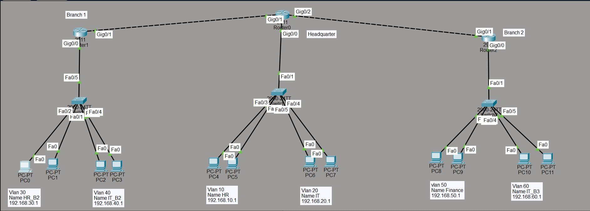

---

## Project Overview

This project simulates a multi-site enterprise network consisting of a Headquarters location and two Branch Offices interconnected through OSPF dynamic routing.

The network was designed to provide:

- Secure inter-site communication
- Departmental network segmentation using VLANs
- Inter-VLAN communication using Router-on-a-Stick
- Dynamic IP addressing with DHCP
- Secure remote management using SSH
- Access control using Extended ACLs
- Scalable routing through OSPF Area 0

---

## Business Scenario

A growing organization required a secure and scalable network infrastructure connecting its Headquarters and Branch Offices.

Each department needed isolated broadcast domains, centralized routing, automated IP addressing, and secure administrative access. Additionally, sensitive Finance resources needed protection from unauthorized departmental access.

This solution was implemented using Cisco Packet Tracer and validated through routing, switching, security, and connectivity testing.

---

## Network Architecture

### Headquarters

| VLAN | Department | Network |
|--------|------------|------------|
| VLAN 10 | HR | 192.168.10.0/24 |
| VLAN 20 | IT | 192.168.20.0/24 |

### Branch Office 1

| VLAN | Department | Network |
|--------|------------|------------|
| VLAN 30 | HR_B2 | 192.168.30.0/24 |
| VLAN 40 | IT_B2 | 192.168.40.0/24 |

### Branch Office 2

| VLAN | Department | Network |
|--------|------------|------------|
| VLAN 50 | Finance | 192.168.50.0/24 |
| VLAN 60 | IT_B3 | 192.168.60.0/24 |

### WAN Links

| Link | Network |
|--------|------------|
| HQ ↔ Branch 1 | 192.168.70.0/24 |
| HQ ↔ Branch 2 | 192.168.80.0/24 |

---

## Technologies Implemented

- OSPF Area 0
- VLAN Segmentation
- Router-on-a-Stick
- DHCP Services
- SSH Remote Administration
- Extended ACLs
- 802.1Q Trunking
- Cisco Packet Tracer

---

## Security Implementation

An Extended Access Control List (ACL) named **Finance-Protect** was implemented to secure the Finance VLAN.

The ACL blocks access attempts from HR networks while allowing legitimate business traffic to continue across the enterprise network.

### ACL Verification

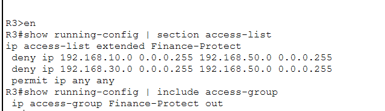

---

## OSPF Verification

OSPF neighbor relationships were successfully established between Headquarters and both Branch Offices.

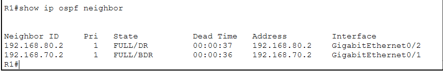

---

## Routing Verification

Routing tables confirm successful route advertisement and learning through OSPF.

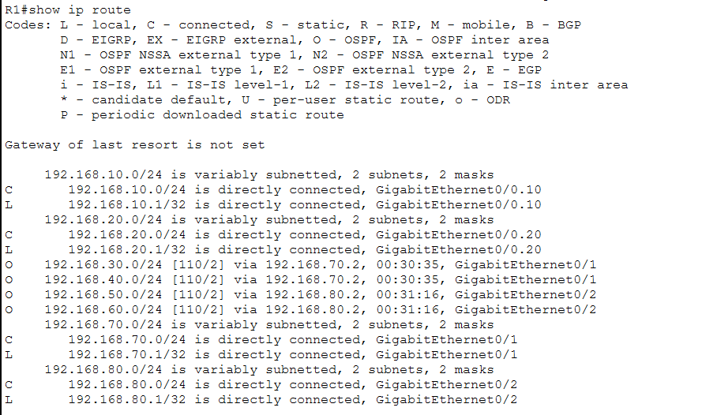

---

## DHCP Verification

DHCP services automatically assigned addresses to end devices within the Headquarters VLANs.

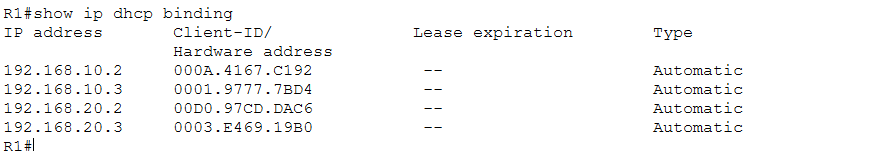

---

## VLAN Verification

### Headquarters VLANs

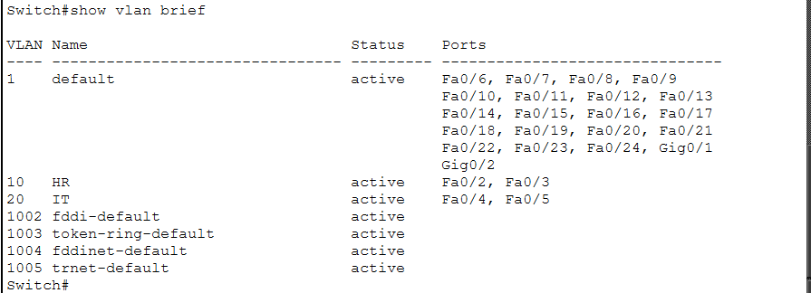

### Branch Office 1 VLANs

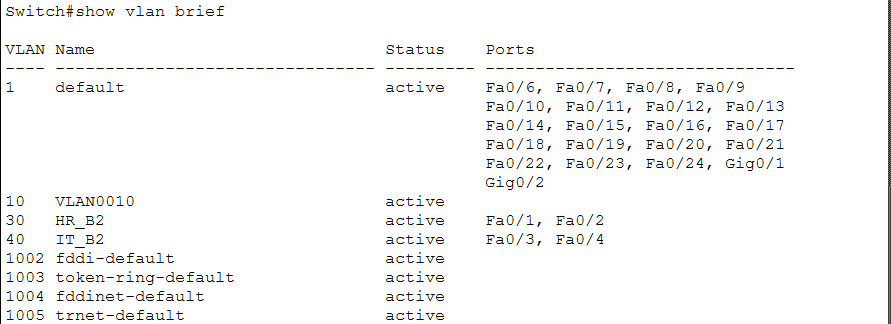

### Branch Office 2 VLANs

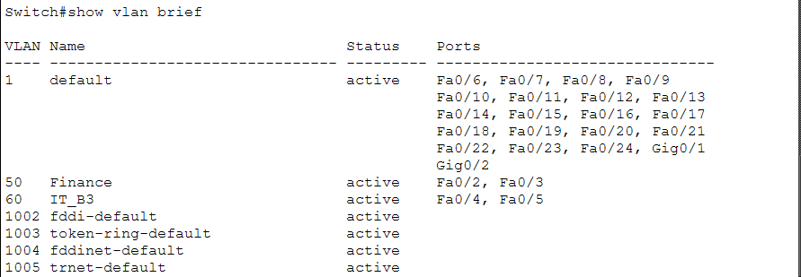

---

## Trunk Verification

### Headquarters Trunk

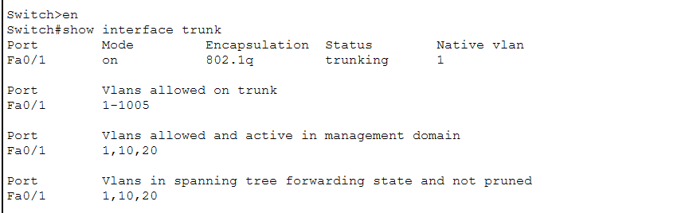

### Branch Office 1 Trunk

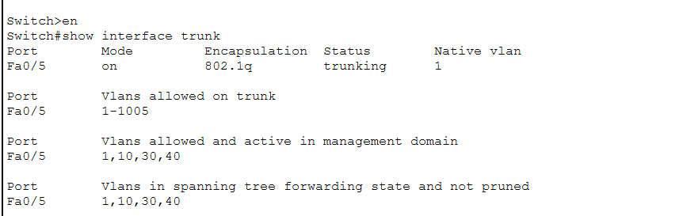

### Branch Office 2 Trunk

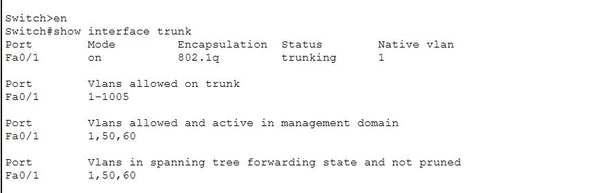

---

## Connectivity Validation

End-to-end connectivity was successfully validated between remote sites.

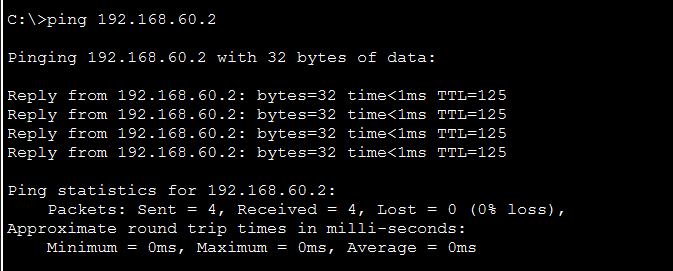

---

## SSH Remote Management

SSH Version 2 was configured for secure administrative access to network devices.


---

## Challenges Encountered

### OSPF Neighbor Troubleshooting

During implementation, OSPF adjacency verification required:

- WAN connectivity validation
- Interface verification
- OSPF network statement verification
- Route propagation validation

### ACL Validation

ACL placement and traffic flow testing were performed to ensure Finance resources remained protected while maintaining legitimate communication.

---

## Key Learning Outcomes

- Multi-Site Enterprise Network Design
- OSPF Dynamic Routing
- VLAN Segmentation
- Router-on-a-Stick Implementation
- DHCP Deployment
- Extended ACL Security
- SSH Administration
- Enterprise Troubleshooting Methodology

---

## Repository Structure

```text
enterprise-network-with-ospf-vlans-and-acls/
│
├── README.md
│
├── packet-tracer-file/
│   └── HQ-Branch-Enterprise-Network.pkt
│
└── screenshots/
    ├── topology.png
    ├── ospf-neighbor-state.png
    ├── routing-table.png
    ├── dhcp-leases.png
    ├── hq-vlans.png
    ├── branch1-vlans.png
    ├── branch2-vlans.png
    ├── trunk-status-hq.png
    ├── trunk-status-branch1.png
    ├── trunk-status-branch2.png
    ├── ssh-login.png
    ├── finance-acl.png
    └── connectivity-test.png
```

---

## Author

**Yashjeet Barak**

CCNA Candidate | Networking | Cybersecurity

GitHub: https://github.com/yashjeetbarak

This project was designed, implemented, validated, and documented using Cisco Packet Tracer as part of my networking and cybersecurity portfolio.

CCNA | Networking | Cybersecurity | Cisco Packet Tracer Labs
